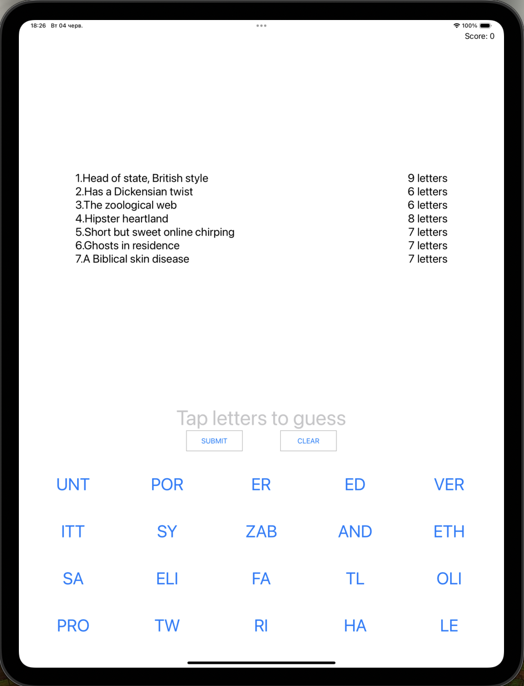
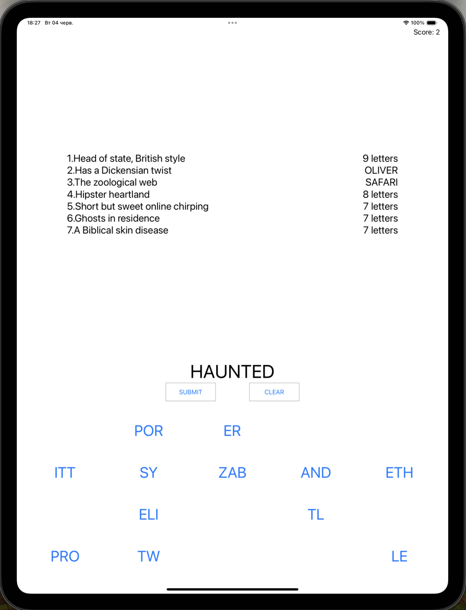

# Project8

Project8 is a word guessing game app for iOS devices that challenges users to form words by tapping on the correct letters. The game features multiple levels with unique sets of words to guess.

## Features

* Displays a list of letters for users to tap on to form words.
* Allows users to submit their answers for feedback.
* Displays the score and current level number.
* Provides feedback on correct and incorrect guesses.
* Offers a dynamic and interactive UI experience.

## Screenshots

  
   
  <em>Word Guessing Game Screen</em>

  
   
  <em>Game In Progress</em>

## Requirements

* iOS 12.0+
* Xcode 12.0+
* Swift 5.0+

## Usage

1. Launch the app.
2. Tap on the letters to form words.
3. Submit your word for feedback.
4. Progress through levels by guessing words correctly.
5. Enjoy a challenging and engaging word game experience.

## Code Overview

### ViewController

* Manages user interactions and updates the UI accordingly.
* Implements features for letter tapping, submitting guesses, and clearing inputs.
* Loads levels with clues and solutions for users to guess.
* Updates the score based on correct guesses and handles level progression.

### Possible Improvements

* Add hint features to assist users in challenging levels.
* Enhance the UI with animations and visual cues for better user engagement.
* Introduce more levels with diverse word sets for increased gameplay variety.
* Implement sharing options or leaderboard features to enhance user experience.
